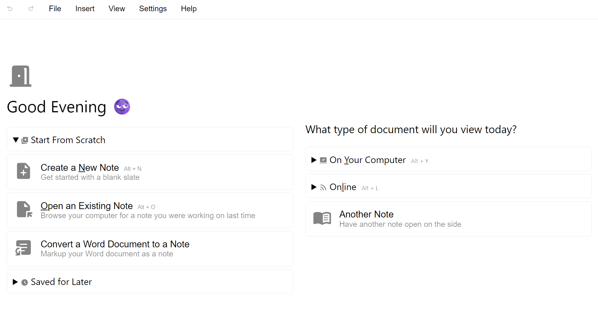

  

# NoteMaster

Take your note-taking to another level with NoteMaster - a lightweight note-taking app for the web! Whether you are taking notes during a class or jotting down key points from a report, NoteMaster helps you do this effortlessly, all within the same app. You can edit your note side-by-side with another type of document or online resource of your choice - like a PDF, image, video, source code file, webpage, or online design - and adjust the amount of space the editor and viewing area take up on your screen to maximize your productivity. Once you want to share your ideas with the world, NoteMaster allows you to send a copy of your work to another person for quick access in their browser.

## 📃 Features

- Start from scratch and create a new note or open an existing one from your device
- Format your note with bold text, italics, underlined text, strike-through text, block quotes, lists, headings, text colors, highlights, text alignment, and more
- Save your note in-app or directly download it in HTML or plain text format once you want to move on
- Share a copy of your note to another person for online access in any browser
- Edit your note side-by-side with another type of document or online resource of your choice, like a PDF, image, video, source code file, webpage, and more
- Adjust the amount of space the editor and viewing area take up on your screen
- Keep track of the documents you open on the side with the, "Viewing History" feature
- Insert online images, tables, dates and times, and special characters into your note
- Note-taking at night? Use the available Dark Mode to relieve your eyes
- Want to make NoteMaster your own? Create and import your own CSS style sheet to take effect across the app's UI
